## Project: Build a Traffic Sign Recognition Program

### Overview

This project involves using deep neural networks and convolutional neural networks to classify traffic signs. The first step is to train and validate a model so it can classify traffic sign images using the [German Traffic Sign Dataset](http://benchmark.ini.rub.de/?section=gtsrb&subsection=dataset). After the model is trained, the next step will involve trying out the model on images of German traffic signs that was found on the web.


---

### The Project

The goals / steps of this project are the following:
* Load the data set
* Explore, summarize and visualize the data set
* Preprocess and augment the image data
* Design, train and test a model architecture
* Use the model to make predictions on new images
* Analyze the softmax probabilities of the new images
* Visualize the **Feature Maps** for each convolutional layer in the network

---

### Dependencies
This project requires:

* [CarND Term1 Starter Kit](https://github.com/udacity/CarND-Term1-Starter-Kit)

The lab environment can be created with CarND Term1 Starter Kit. Click [here](https://github.com/udacity/CarND-Term1-Starter-Kit/blob/master/README.md) for the details.

---

### Data Set

Download the data set from the following [link](https://d17h27t6h515a5.cloudfront.net/topher/2017/February/5898cd6f_traffic-signs-data/traffic-signs-data.zip).This is a pickled dataset in which the images are already resized to 32x32. It contains a training, validation and test set.

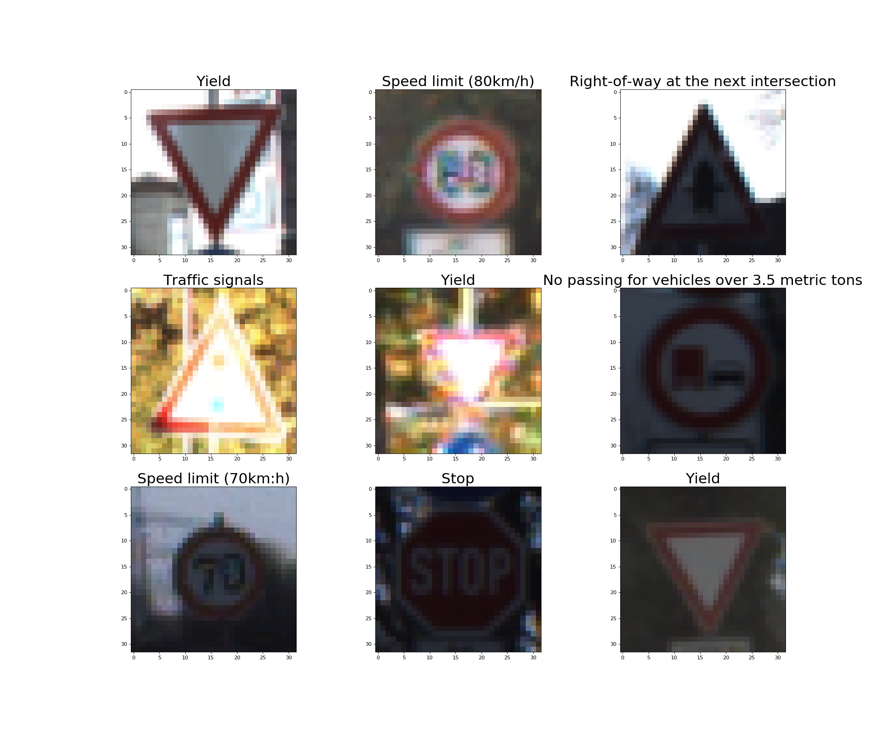

---

### Data Set Summary & Exploration

The pandas library was used to calculate the summary statistics of the traffic
signs data set:

* The size of training set is 34799
* The size of the validation set is 4410
* The size of test set is 12630
* The shape of a traffic sign image is (32,32,3)
* The number of unique classes/labels in the data set is 43

---

### Exploratory visualization of the Data Set.

#### Training Data Set Class Distribution
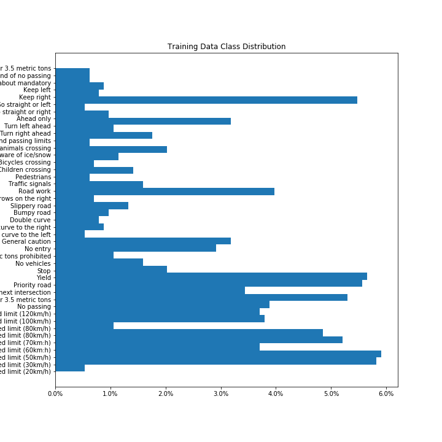

#### Validation Data Set Class Distribution
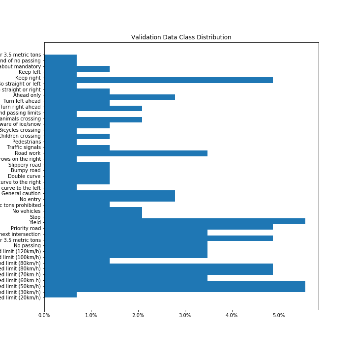

#### Testing Data Set Class Distribution


From the above three plots it can be seen that stratified sampling technique had been used to separate the data into the three sets, i.e.( Training, Validation and Testing), as each dataset has a similar distribution. However, the percentage of Traffic sign classes in each dataset is not equally distributed as there is a higher percentage of some traffic sign classes than others in each of the datasets. This in turn may result in the **CNN** overfitting the traffic sign classes that are more common in the dataset.

---

### Preprocess & Augment the Images

#### Normalize the Images
Minimally, the image data should be normalized so that the data has mean zero and equal variance. For image data, `(pixel - 128)/ 128` is a quick way to approximately normalize the data and can be used in this project.

The following function was used to normalize the images:

```
def normalize_image_data(image_data):
    return (image_data - [128])/[128])
```

#### Augment the Images

This step consists of applying helper functions to augment the traffic sign images. The traffic sign images which are augmented are those whose percentage of occurrence in the training dataset is less than the set ```THRESHOLD``` value and the images are also augmented at random.

The following augmentation functions are applied to the images
- Transpose : ``` tf.image.transpose(image)```
- Flip Left to Right: ``` tf.image.flip_left_right(image)```
- Random Contrast: ```tf.image.random_contrast(image,lower,upper)```
- Brightness: ```tf.image.adjust_brightness(image,delta)```

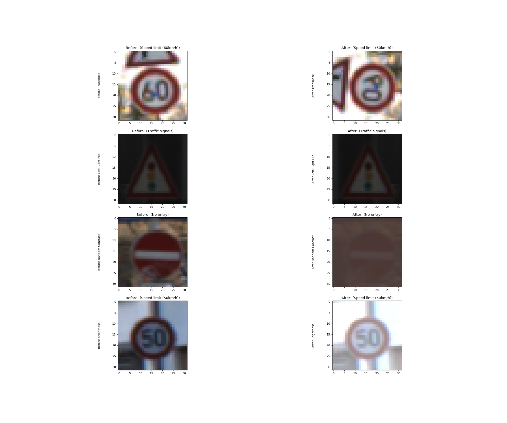

A total of 4% of the images in the training dataset is augmented.

---

### Design the Model Architecture

This step involves designing and implementing a deep learning model that learns to recognize traffic signs. The model is  trained and tested on the [German Traffic Sign Dataset](http://benchmark.ini.rub.de/?section=gtsrb&subsection=dataset).

The LeNet-5 implementation shown in the [classroom](https://classroom.udacity.com/nanodegrees/nd013/parts/fbf77062-5703-404e-b60c-95b78b2f3f9e/modules/6df7ae49-c61c-4bb2-a23e-6527e69209ec/lessons/601ae704-1035-4287-8b11-e2c2716217ad/concepts/d4aca031-508f-4e0b-b493-e7b706120f81) was used as a starting point.

The LeNet-5 implementation, resulted in a validation set accuracy of about 0.89 and therefore a higher performing CNN would need to be designed in order to complete the project successfully.

There are various aspects to consider when designing the Deep Neural Network, which includes:

- Neural network architecture (is the network over or underfitting?)
- Applying preprocessing techniques (normalization, rgb to grayscale, etc)
- Number of examples per label (some have more than others).
- Generating fake data.

This is an example of a [published baseline model on this problem](http://yann.lecun.com/exdb/publis/pdf/sermanet-ijcnn-11.pdf).


The Model I finally designed was partly inspired by the **VGG-16** Model and the architecture of the model is as follows.


---

### Train, Validate & Evaluate the Model
The Model was trained over ```10 EPOCHS``` and in ```BATCH_SIZE``` of ```128```, with a learning ```rate``` of ```0.001```
and a ```keep_prob``` of ```0.8``` for the ```Dropout``` parameter (i.e. to limit overfitting).

#### Train the Model

Training the model involved the following steps.

1. Run the training data through the training pipeline to train the model.
2. Before each epoch, shuffle the training set.
3. After each epoch, measure the loss and accuracy on the validation set.
4. Save the model after each epoch, only when there is increase in validation accuracy.

The training pipeline that uses the CustomNet model to classify Traffic Sign data is as follows:

```
logits = CustomNet(x,keep_prob)
cross_entropy = tf.nn.softmax_cross_entropy_with_logits(labels=one_hot_y, logits=logits) #Cross entropy loss function
loss_operation = tf.reduce_mean(cross_entropy) #Reduce mean cross entropy operation
optimizer = tf.train.AdamOptimizer(learning_rate = rate) #Uses Adam Optimizer
training_operation = optimizer.minimize(loss_operation)
```
#### Evaluate the Model

The following function takes the features ```X_data``` and the correct labels ```y_data```
and evaluates the prediction accuracy of the model.

```
def evaluate(X_data, y_data):
    num_examples = len(X_data)
    total_accuracy = 0
    sess = tf.get_default_session()
    for offset in range(0, num_examples, BATCH_SIZE):
        batch_x, batch_y = X_data[offset:offset+BATCH_SIZE], y_data[offset:offset+BATCH_SIZE]
        accuracy = sess.run(accuracy_operation, feed_dict={x: batch_x, y: batch_y, keep_prob:1.0})
        total_accuracy += (accuracy * len(batch_x))
    return total_accuracy / num_examples
```

The model was evaluated on the validation data set and the following plot helps visualize the model's
performance after each epoch.

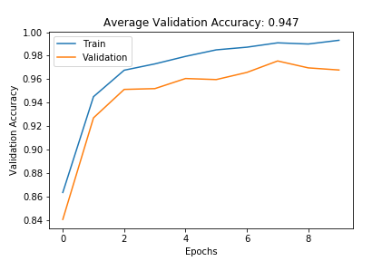  

The overall accuracy on the validation data set is 94.7%, It can also be seen that the model tends to overfit the training data set after 7 Epochs as training and validation accuracy tend to slightly diverge.

The final accuracy on the test data set is 91.6%.

#### Evaluate the Model on Images Downloaded from the web

The following images were downloaded from the Web and resized and feed into the model, for it to predict what the traffic sign is.

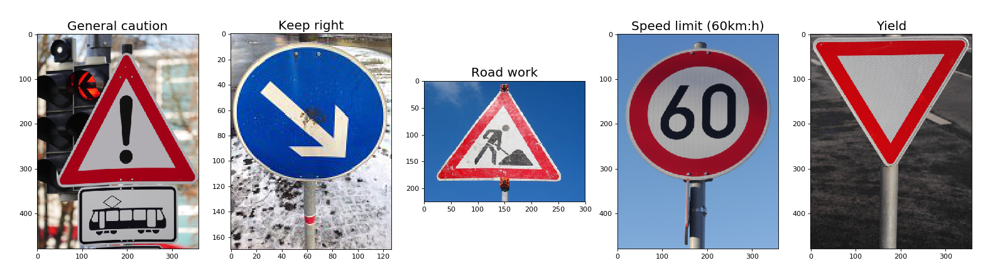


The overall accuracy of the model in predicting the traffic signs for the five images is 20%. However this does not give a comprehensive overview of the performance of the model.

The top 5 predictions for each of the images is as follows.

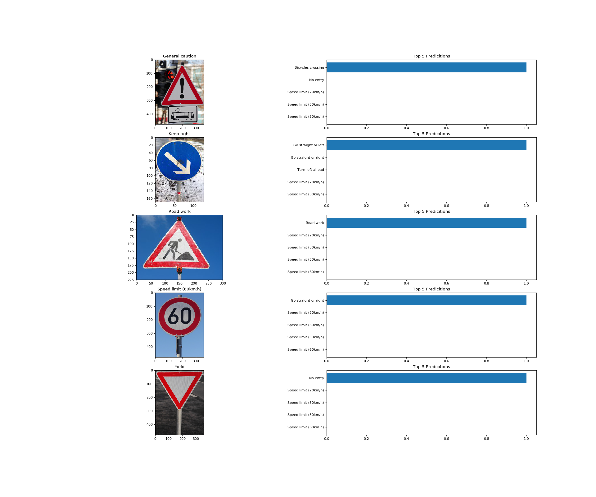


### Visualize the Feature Maps of the convolutional Layers

To get a deeper and a more visual understanding of what the feature maps in each convolutional layer in the deep neural network learns, the following function can be used.

```
def outputFeatureMap(image_input, tf_activation,image_name,activation_min=-1, activation_max=-1 ,plt_num=1,):
    with tf.Session() as sess:
        saver.restore(sess, save_file)
        activation = tf_activation.eval(session=sess,feed_dict={x : image_input})
        featuremaps = activation.shape[3]
        plt.figure(plt_num, figsize=(15,15))
        for featuremap in range(featuremaps):
            plt.subplot(6,8, featuremap+1) # sets the number of feature maps to show on each row and column
            plt.title('FeatureMap ' + str(featuremap)) # displays the feature map number
            if activation_min != -1 & activation_max != -1:
                plt.imshow(activation[0,:,:, featuremap], interpolation="nearest", vmin =activation_min, vmax=activation_max, cmap="gray")
            elif activation_max != -1:
                plt.imshow(activation[0,:,:, featuremap], interpolation="nearest", vmax=activation_max, cmap="gray")
            elif activation_min !=-1:
                plt.imshow(activation[0,:,:, featuremap], interpolation="nearest", vmin=activation_min, cmap="gray")
            else:
                plt.imshow(activation[0,:,:, featuremap], interpolation="nearest", cmap="gray")
        plt.savefig(image_name)
```
#### convolutional Layer 1
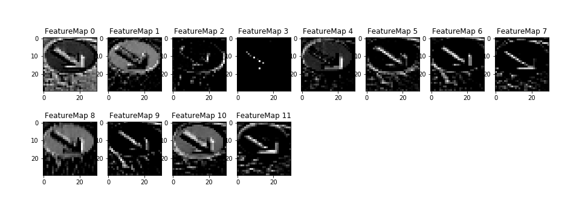
#### convolutional Layer 2
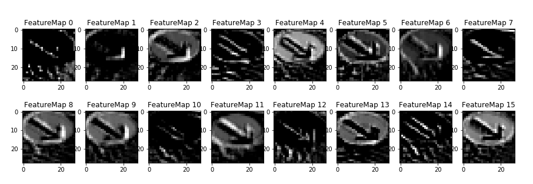
#### convolutional Layer 3
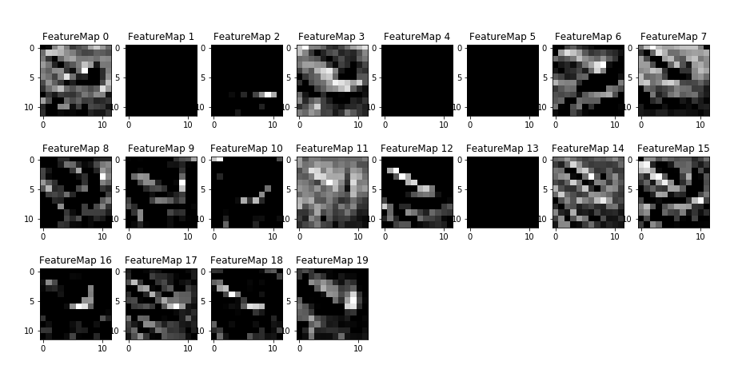
#### convolutional Layer 4
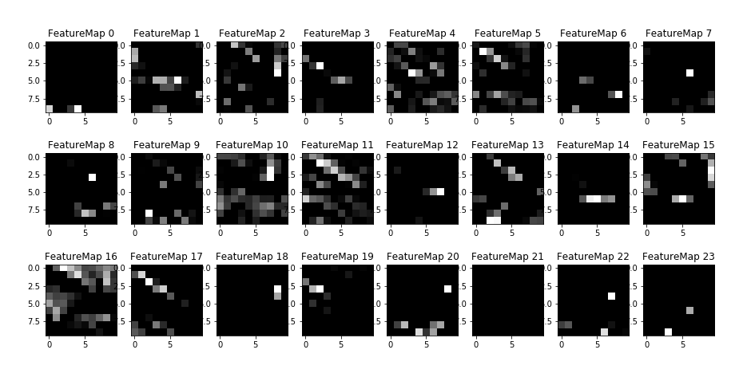

### Conclusion

The model achieves an overall accuracy of 94.7% on the validation data set and an accuracy of 91.6% on the test data set and therefore the goal of the project has been achieved. However, the performance of the model has a lot more for improvement, some of these improvements can be made by.

- Carrying out detailed analysis of model performance by looking at the predictions in more detail by calculating the precision and recall for each traffic sign type from the test set and then compare performance on these five new images.

- Generating more augmented data or gathering more data, for those traffic signs that make up less than 5% of the data set, in order to train the model.

-  Designing and training more complex convolutional neural networks such as AlexNet, VGG-19 or even GoogLeNet.
